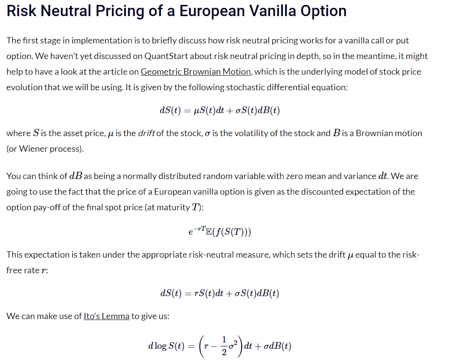
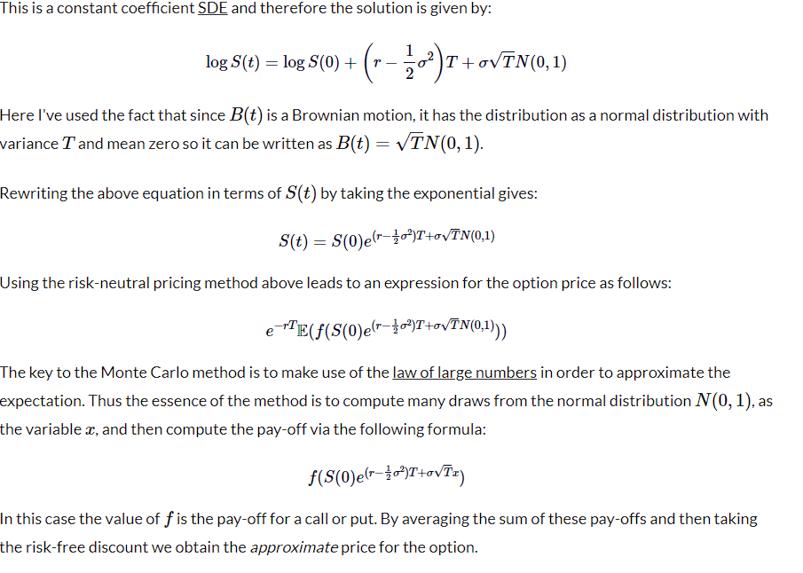

#Price-European-Options-Monte-Carlo
How to price European Options (Call and Put) with Monte Carlo in C++

credit:
https://www.quantstart.com/articles/European-vanilla-option-pricing-with-C-via-Monte-Carlo-methods/
https://www.youtube.com/watch?v=0US8rgLvE-4&ab_channel=JustWriteTheCode
